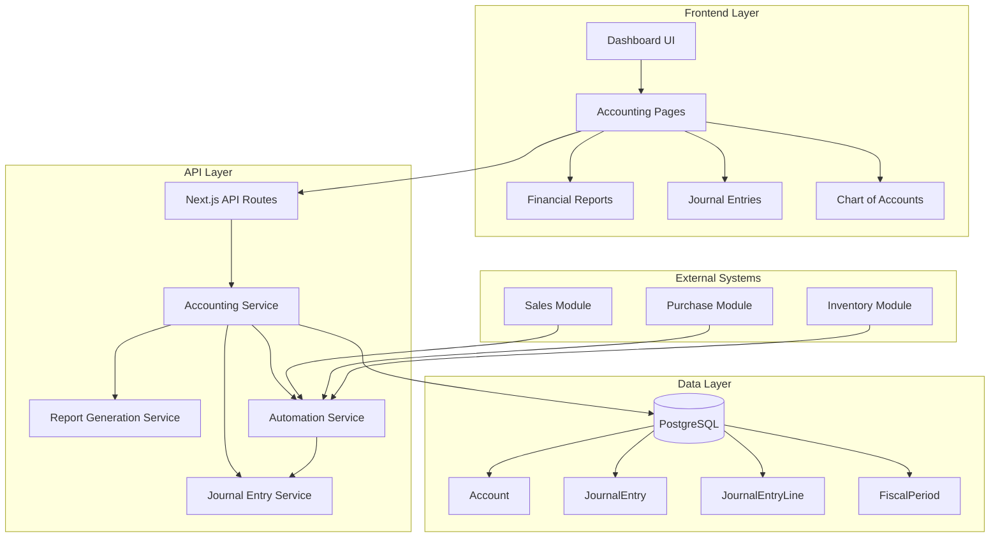
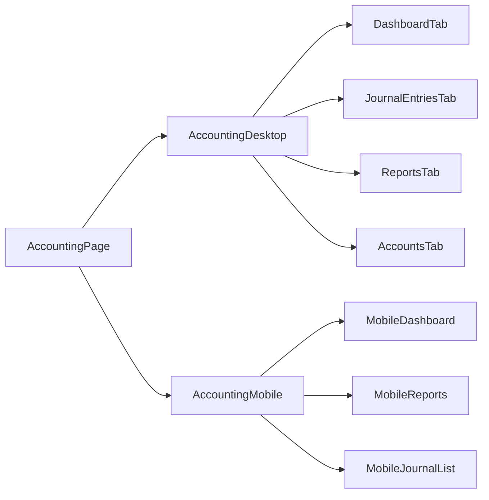

# Design Document - Accounting Module

## Overview

The Accounting Module is a comprehensive financial management system integrated into the existing POS/ERP platform. It provides double-entry bookkeeping, automated journal entries from business transactions, financial reporting, and multi-branch cost center tracking. The module follows the existing Next.js 14 App Router architecture with Prisma ORM, PostgreSQL database, and role-based access control.

### Key Design Principles

1. **Double-Entry Integrity**: Every transaction maintains the fundamental accounting equation (Assets = Liabilities + Equity)
2. **Automation-First**: Business transactions automatically generate accounting entries without manual intervention
3. **Multi-Branch Support**: Financial data is tracked per branch (cost center) with consolidation capabilities
4. **Audit Trail**: Complete immutable history of all financial transactions
5. **Performance**: Optimized queries with pagination, caching, and database indexes
6. **Mobile-First UI**: Responsive design following the existing slate color scheme and hugeicons-react

### Integration Points

- **Sales Module**: Automated journal entries from POS sales
- **Purchase Module**: Automated journal entries from purchase orders
- **Inventory Module**: Cost of goods sold calculations
- **Cash Sessions**: Cash account reconciliation
- **User Management**: Role-based access control (OWNER, MANAGER, SUPER_ADMIN)

## Architecture

### System Architecture



### Component Architecture



## Data Model

### Database Schema (Prisma)

```prisma
enum AccountType {
  ASSET
  LIABILITY
  EQUITY
  REVENUE
  EXPENSE
}

enum TransactionSource {
  MANUAL
  SALE
  PURCHASE
  CASH_SESSION
  INVENTORY
  ADJUSTMENT
}

enum FiscalPeriodStatus {
  OPEN
  CLOSED
}

model Account {
  id            String      @id @default(uuid())
  businessId    String
  code          String      // e.g., "1010", "4010"
  name          String      // e.g., "Cash", "Sales Revenue"
  type          AccountType
  parentId      String?
  isActive      Boolean     @default(true)
  balance       Decimal     @default(0) @db.Decimal(15, 2)
  
  business      Business    @relation(fields: [businessId], references: [id])
  parent        Account?    @relation("AccountHierarchy", fields: [parentId], references: [id])
  children      Account[]   @relation("AccountHierarchy")
  
  journalLines  JournalEntryLine[]
  
  createdAt     DateTime    @default(now())
  updatedAt     DateTime    @updatedAt
  
  @@unique([businessId, code])
  @@index([businessId, type])
  @@index([businessId, isActive])
}

model JournalEntry {
  id              String            @id @default(uuid())
  businessId      String
  branchId        String
  entryNumber     Int               // Sequential number per business
  entryDate       DateTime
  description     String
  source          TransactionSource
  sourceId        String?           // Reference to Sale, Purchase, etc.
  isReversed      Boolean           @default(false)
  reversalOfId    String?           // Reference to original entry if this is a reversal
  attachments     String[]          // URLs to supporting documents
  
  createdById     String
  createdAt       DateTime          @default(now())
  updatedAt       DateTime          @updatedAt
  
  business        Business          @relation(fields: [businessId], references: [id])
  branch          Branch            @relation(fields: [branchId], references: [id])
  createdBy       User              @relation(fields: [createdById], references: [id])
  reversalOf      JournalEntry?     @relation("JournalReversal", fields: [reversalOfId], references: [id])
  reversals       JournalEntry[]    @relation("JournalReversal")
  
  lines           JournalEntryLine[]
  
  @@unique([businessId, entryNumber])
  @@index([businessId, entryDate])
  @@index([branchId, entryDate])
  @@index([source, sourceId])
}

model JournalEntryLine {
  id              String        @id @default(uuid())
  journalEntryId  String
  accountId       String
  debit           Decimal       @default(0) @db.Decimal(15, 2)
  credit          Decimal       @default(0) @db.Decimal(15, 2)
  description     String?
  
  journalEntry    JournalEntry  @relation(fields: [journalEntryId], references: [id], onDelete: Cascade)
  account         Account       @relation(fields: [accountId], references: [id])
  
  @@index([journalEntryId])
  @@index([accountId])
}

model FiscalPeriod {
  id          String             @id @default(uuid())
  businessId  String
  name        String             // e.g., "2024-Q1", "2024-12"
  startDate   DateTime
  endDate     DateTime
  status      FiscalPeriodStatus @default(OPEN)
  closedAt    DateTime?
  closedById  String?
  
  business    Business           @relation(fields: [businessId], references: [id])
  closedBy    User?              @relation(fields: [closedById], references: [id])
  
  createdAt   DateTime           @default(now())
  updatedAt   DateTime           @updatedAt
  
  @@unique([businessId, name])
  @@index([businessId, status])
}

model AccountsReceivable {
  id          String    @id @default(uuid())
  businessId  String
  customerId  String
  saleId      String    @unique
  invoiceDate DateTime
  dueDate     DateTime
  amount      Decimal   @db.Decimal(12, 2)
  paidAmount  Decimal   @default(0) @db.Decimal(12, 2)
  balance     Decimal   @db.Decimal(12, 2)
  
  business    Business  @relation(fields: [businessId], references: [id])
  customer    Customer  @relation(fields: [customerId], references: [id])
  sale        Sale      @relation(fields: [saleId], references: [id])
  
  payments    ARPayment[]
  
  createdAt   DateTime  @default(now())
  updatedAt   DateTime  @updatedAt
  
  @@index([businessId, customerId])
  @@index([dueDate])
}

model ARPayment {
  id          String             @id @default(uuid())
  arId        String
  amount      Decimal            @db.Decimal(12, 2)
  paymentDate DateTime
  reference   String?
  
  ar          AccountsReceivable @relation(fields: [arId], references: [id])
  
  createdAt   DateTime           @default(now())
}

model AccountsPayable {
  id            String        @id @default(uuid())
  businessId    String
  supplierId    String
  purchaseId    String        @unique
  invoiceDate   DateTime
  dueDate       DateTime
  amount        Decimal       @db.Decimal(12, 2)
  paidAmount    Decimal       @default(0) @db.Decimal(12, 2)
  balance       Decimal       @db.Decimal(12, 2)
  
  business      Business      @relation(fields: [businessId], references: [id])
  supplier      Supplier      @relation(fields: [supplierId], references: [id])
  purchase      PurchaseOrder @relation(fields: [purchaseId], references: [id])
  
  payments      APPayment[]
  
  createdAt     DateTime      @default(now())
  updatedAt     DateTime      @updatedAt
  
  @@index([businessId, supplierId])
  @@index([dueDate])
}

model APPayment {
  id          String           @id @default(uuid())
  apId        String
  amount      Decimal          @db.Decimal(12, 2)
  paymentDate DateTime
  reference   String?
  
  ap          AccountsPayable  @relation(fields: [apId], references: [id])
  
  createdAt   DateTime         @default(now())
}

model BankReconciliation {
  id                String    @id @default(uuid())
  businessId        String
  accountId         String    // Bank account
  statementDate     DateTime
  statementBalance  Decimal   @db.Decimal(15, 2)
  bookBalance       Decimal   @db.Decimal(15, 2)
  difference        Decimal   @db.Decimal(15, 2)
  isReconciled      Boolean   @default(false)
  reconciledAt      DateTime?
  reconciledById    String?
  
  business          Business  @relation(fields: [businessId], references: [id])
  account           Account   @relation(fields: [accountId], references: [id])
  reconciledBy      User?     @relation(fields: [reconciledById], references: [id])
  
  items             BankReconciliationItem[]
  
  createdAt         DateTime  @default(now())
  updatedAt         DateTime  @updatedAt
  
  @@index([businessId, accountId])
}

model BankReconciliationItem {
  id              String             @id @default(uuid())
  reconciliationId String
  journalEntryId  String
  isCleared       Boolean            @default(false)
  
  reconciliation  BankReconciliation @relation(fields: [reconciliationId], references: [id], onDelete: Cascade)
  journalEntry    JournalEntry       @relation(fields: [journalEntryId], references: [id])
  
  @@index([reconciliationId])
}
```

### Relationships with Existing Models

```prisma
// Add to existing Business model
model Business {
  // ... existing fields
  accounts              Account[]
  journalEntries        JournalEntry[]
  fiscalPeriods         FiscalPeriod[]
  accountsReceivable    AccountsReceivable[]
  accountsPayable       AccountsPayable[]
  bankReconciliations   BankReconciliation[]
}

// Add to existing Branch model
model Branch {
  // ... existing fields
  journalEntries  JournalEntry[]
}

// Add to existing User model
model User {
  // ... existing fields
  journalEntries        JournalEntry[]
  fiscalPeriodsClosed   FiscalPeriod[]
  bankReconciliations   BankReconciliation[]
}

// Add to existing Customer model
model Customer {
  // ... existing fields
  accountsReceivable  AccountsReceivable[]
}

// Add to existing Supplier model
model Supplier {
  // ... existing fields
  accountsPayable  AccountsPayable[]
}

// Add to existing Sale model
model Sale {
  // ... existing fields
  accountsReceivable  AccountsReceivable?
}

// Add to existing PurchaseOrder model
model PurchaseOrder {
  // ... existing fields
  accountsPayable  AccountsPayable?
}
```

## API Design

### API Routes Structure

```
/api/accounting/
├── accounts/
│   ├── route.ts                    # GET (list), POST (create)
│   └── [id]/
│       └── route.ts                # GET, PUT, DELETE
├── journal-entries/
│   ├── route.ts                    # GET (list), POST (create)
│   ├── [id]/
│   │   └── route.ts                # GET, PUT, DELETE
│   └── reverse/
│       └── route.ts                # POST (reverse entry)
├── reports/
│   ├── balance-sheet/
│   │   └── route.ts                # POST (generate)
│   ├── income-statement/
│   │   └── route.ts                # POST (generate)
│   ├── cash-flow/
│   │   └── route.ts                # POST (generate)
│   ├── general-ledger/
│   │   └── route.ts                # POST (generate)
│   └── export/
│       └── route.ts                # POST (export to PDF/Excel)
├── receivables/
│   ├── route.ts                    # GET (list)
│   ├── [id]/
│   │   └── route.ts                # GET
│   ├── aging/
│   │   └── route.ts                # GET (aging report)
│   └── payment/
│       └── route.ts                # POST (record payment)
├── payables/
│   ├── route.ts                    # GET (list)
│   ├── [id]/
│   │   └── route.ts                # GET
│   ├── aging/
│   │   └── route.ts                # GET (aging report)
│   └── payment/
│       └── route.ts                # POST (record payment)
├── reconciliation/
│   ├── route.ts                    # GET (list), POST (create)
│   └── [id]/
│       ├── route.ts                # GET, PUT
│       └── clear/
│           └── route.ts            # POST (mark items cleared)
├── fiscal-periods/
│   ├── route.ts                    # GET (list), POST (create)
│   └── [id]/
│       ├── close/
│       │   └── route.ts            # POST (close period)
│       └── reopen/
│           └── route.ts            # POST (reopen period)
└── dashboard/
    └── route.ts                    # GET (dashboard metrics)
```

### Key API Endpoints

#### 1. Chart of Accounts

**GET /api/accounting/accounts**
- Query params: `businessId`, `type`, `isActive`
- Returns: Hierarchical list of accounts
- Auth: OWNER, MANAGER, SUPER_ADMIN

**POST /api/accounting/accounts**
- Body: `{ code, name, type, parentId?, businessId }`
- Returns: Created account
- Auth: OWNER, MANAGER

#### 2. Journal Entries

**POST /api/accounting/journal-entries**
- Body: `{ entryDate, description, branchId, lines: [{ accountId, debit, credit }] }`
- Validates: debits === credits
- Returns: Created journal entry with entry number
- Auth: OWNER, MANAGER

**POST /api/accounting/journal-entries/reverse**
- Body: `{ journalEntryId }`
- Creates: Offsetting entry with reversed debits/credits
- Returns: New reversal entry
- Auth: OWNER, MANAGER

#### 3. Financial Reports

**POST /api/accounting/reports/balance-sheet**
- Body: `{ date, branchId? }`
- Returns: `{ assets: [], liabilities: [], equity: [], totals }`
- Auth: OWNER, MANAGER, SUPER_ADMIN

**POST /api/accounting/reports/income-statement**
- Body: `{ startDate, endDate, branchId?, comparePrevious? }`
- Returns: `{ revenue: [], expenses: [], grossProfit, netProfit }`
- Auth: OWNER, MANAGER, SUPER_ADMIN

## UI Design

### Page Structure

```
/dashboard/accounting
├── Main Dashboard (default tab)
├── Journal Entries
├── Chart of Accounts
├── Reports
│   ├── Balance Sheet
│   ├── Income Statement
│   ├── Cash Flow
│   └── General Ledger
├── Receivables
├── Payables
├── Reconciliation
└── Fiscal Periods
```

### Component Hierarchy

```
AccountingPage (page.tsx)
├── AccountingDesktop (lazy-loaded)
│   ├── AccountingTabs
│   │   ├── DashboardTab
│   │   │   ├── FinancialMetricsCards
│   │   │   ├── RevenueExpenseChart
│   │   │   └── BranchComparisonTable
│   │   ├── JournalEntriesTab
│   │   │   ├── JournalEntryList
│   │   │   ├── JournalEntryModal
│   │   │   └── JournalEntryDetail
│   │   ├── AccountsTab
│   │   │   ├── ChartOfAccountsTree
│   │   │   └── AccountModal
│   │   └── ReportsTab
│   │       ├── ReportSelector
│   │       ├── ReportFilters
│   │       └── ReportViewer
│   └── ExportMenu
└── AccountingMobile
    ├── MobileAccountingHeader
    ├── MobileDashboard
    ├── MobileJournalList
    ├── MobileReportsList
    └── MobileBottomSheet (for filters/actions)
```

### Mobile UI Patterns

Following the existing mobile patterns from products and POS pages:

```tsx
// Mobile Header with Actions
<div className="flex items-center gap-2">
  <div className="flex-1 min-w-0">
    <h1 className="text-xl font-black text-slate-900">Contabilidad</h1>
    <p className="text-xs text-slate-400">Dashboard financiero</p>
  </div>
  <button className="h-10 w-10 rounded-xl bg-slate-900 text-white">
    <PlusSignIcon className="w-5 h-5" />
  </button>
</div>

// Mobile Metric Cards
<div className="grid grid-cols-2 gap-2.5">
  <div className="bg-gradient-to-br from-emerald-500 to-emerald-600 rounded-2xl p-3.5 text-white">
    <div className="flex items-center gap-1.5 mb-2">
      <ChartUpIcon className="w-3.5 h-3.5" />
      <span className="text-[10px] font-bold uppercase">Ingresos</span>
    </div>
    <p className="text-xl font-bold">S/ 45,230.00</p>
  </div>
</div>

// Mobile List Items
<div className="bg-white rounded-3xl border border-slate-100 p-4">
  <div className="flex items-center gap-3">
    <div className="w-12 h-12 rounded-2xl bg-slate-100 flex items-center justify-center">
      <FileTextIcon className="w-6 h-6 text-slate-600" />
    </div>
    <div className="flex-1 min-w-0">
      <p className="font-bold text-sm text-slate-900">Asiento #1234</p>
      <p className="text-xs text-slate-500">24 Abr 2026 • Manual</p>
    </div>
  </div>
</div>
```

### Desktop UI Patterns

Following the existing desktop patterns:

```tsx
// Desktop Tabs
<Tabs defaultValue="dashboard">
  <TabsList className="bg-slate-100 p-1 rounded-xl">
    <TabsTrigger value="dashboard">Dashboard</TabsTrigger>
    <TabsTrigger value="journal">Asientos</TabsTrigger>
    <TabsTrigger value="accounts">Cuentas</TabsTrigger>
    <TabsTrigger value="reports">Reportes</TabsTrigger>
  </TabsList>
</Tabs>

// Desktop Data Table
<Table>
  <TableHeader>
    <TableRow>
      <TableHead>Fecha</TableHead>
      <TableHead>Número</TableHead>
      <TableHead>Descripción</TableHead>
      <TableHead className="text-right">Débito</TableHead>
      <TableHead className="text-right">Crédito</TableHead>
    </TableRow>
  </TableHeader>
</Table>
```

## Business Logic

### Automated Journal Entry Service

```typescript
// src/services/accounting/automatedEntries.ts

export class AutomatedJournalEntryService {
  /**
   * Creates journal entry from completed sale
   * Debits: Cash/AR (by payment method)
   * Credits: Sales Revenue
   * Debits: COGS
   * Credits: Inventory
   */
  async createSaleEntry(sale: Sale): Promise<JournalEntry> {
    const lines: JournalEntryLine[] = [];
    
    // Revenue recognition
    for (const payment of sale.payments) {
      const accountCode = this.getPaymentAccountCode(payment.method);
      lines.push({
        accountId: await this.getAccountByCode(accountCode),
        debit: payment.amount,
        credit: 0
      });
    }
    
    lines.push({
      accountId: await this.getAccountByCode('4010'), // Sales Revenue
      debit: 0,
      credit: sale.total
    });
    
    // Cost of goods sold
    const totalCost = await this.calculateSaleCost(sale);
    lines.push({
      accountId: await this.getAccountByCode('5010'), // COGS
      debit: totalCost,
      credit: 0
    });
    
    lines.push({
      accountId: await this.getAccountByCode('1020'), // Inventory
      debit: 0,
      credit: totalCost
    });
    
    return this.createJournalEntry({
      source: 'SALE',
      sourceId: sale.id,
      branchId: sale.branchId,
      description: `Venta ${sale.code}`,
      lines
    });
  }
  
  /**
   * Creates journal entry from received purchase
   * Debits: Inventory
   * Credits: Accounts Payable
   */
  async createPurchaseEntry(purchase: PurchaseOrder): Promise<JournalEntry> {
    const lines = [
      {
        accountId: await this.getAccountByCode('1020'), // Inventory
        debit: purchase.totalAmount,
        credit: 0
      },
      {
        accountId: await this.getAccountByCode('2010'), // Accounts Payable
        debit: 0,
        credit: purchase.totalAmount
      }
    ];
    
    return this.createJournalEntry({
      source: 'PURCHASE',
      sourceId: purchase.id,
      branchId: purchase.branchId,
      description: `Compra a ${purchase.supplier.name}`,
      lines
    });
  }
}
```

### Report Generation Service

```typescript
// src/services/accounting/reports.ts

export class FinancialReportService {
  /**
   * Generates balance sheet as of specific date
   */
  async generateBalanceSheet(params: {
    businessId: string;
    date: Date;
    branchId?: string;
  }): Promise<BalanceSheet> {
    const accounts = await this.getAccountBalances(params);
    
    const assets = accounts.filter(a => a.type === 'ASSET');
    const liabilities = accounts.filter(a => a.type === 'LIABILITY');
    const equity = accounts.filter(a => a.type === 'EQUITY');
    
    const totalAssets = this.sumBalances(assets);
    const totalLiabilities = this.sumBalances(liabilities);
    const totalEquity = this.sumBalances(equity);
    
    // Verify accounting equation
    if (totalAssets !== totalLiabilities + totalEquity) {
      throw new Error('Balance sheet does not balance');
    }
    
    return {
      date: params.date,
      assets: this.groupByHierarchy(assets),
      liabilities: this.groupByHierarchy(liabilities),
      equity: this.groupByHierarchy(equity),
      totals: { totalAssets, totalLiabilities, totalEquity }
    };
  }
  
  /**
   * Generates income statement for period
   */
  async generateIncomeStatement(params: {
    businessId: string;
    startDate: Date;
    endDate: Date;
    branchId?: string;
  }): Promise<IncomeStatement> {
    const transactions = await this.getTransactionsInPeriod(params);
    
    const revenue = this.filterByAccountType(transactions, 'REVENUE');
    const expenses = this.filterByAccountType(transactions, 'EXPENSE');
    
    const totalRevenue = this.sumCredits(revenue) - this.sumDebits(revenue);
    const totalExpenses = this.sumDebits(expenses) - this.sumCredits(expenses);
    const netProfit = totalRevenue - totalExpenses;
    
    return {
      period: { start: params.startDate, end: params.endDate },
      revenue: this.groupByAccount(revenue),
      expenses: this.groupByAccount(expenses),
      totals: { totalRevenue, totalExpenses, netProfit }
    };
  }
}
```

## Security & Access Control

### Role-Based Permissions

```typescript
// src/middleware/accounting-auth.ts

export const accountingPermissions = {
  SUPER_ADMIN: {
    viewAllBusinesses: true,
    viewReports: true,
    createEntries: false,
    closePeriods: false
  },
  OWNER: {
    viewReports: true,
    createEntries: true,
    editEntries: true,
    deleteEntries: true,
    closePeriods: true,
    manageAccounts: true
  },
  MANAGER: {
    viewReports: true,
    createEntries: true,
    editEntries: true,
    deleteEntries: false,
    closePeriods: false,
    manageAccounts: true
  },
  CASHIER: {
    // No accounting access
  },
  SELLER: {
    // No accounting access
  }
};

export function checkAccountingAccess(
  user: User,
  action: keyof typeof accountingPermissions.OWNER
): boolean {
  const permissions = accountingPermissions[user.role];
  return permissions?.[action] ?? false;
}
```

## Performance Optimization

### Database Indexes

```sql
-- Account lookups
CREATE INDEX idx_account_business_code ON "Account"("businessId", "code");
CREATE INDEX idx_account_business_type ON "Account"("businessId", "type");

-- Journal entry queries
CREATE INDEX idx_journal_business_date ON "JournalEntry"("businessId", "entryDate");
CREATE INDEX idx_journal_branch_date ON "JournalEntry"("branchId", "entryDate");
CREATE INDEX idx_journal_source ON "JournalEntry"("source", "sourceId");

-- Ledger queries
CREATE INDEX idx_journal_line_account ON "JournalEntryLine"("accountId");

-- Receivables/Payables aging
CREATE INDEX idx_ar_due_date ON "AccountsReceivable"("dueDate");
CREATE INDEX idx_ap_due_date ON "AccountsPayable"("dueDate");
```

### Caching Strategy

```typescript
// Cache chart of accounts (rarely changes)
const CACHE_TTL = 5 * 60 * 1000; // 5 minutes

export async function getCachedAccounts(businessId: string) {
  const cacheKey = `accounts:${businessId}`;
  const cached = await redis.get(cacheKey);
  
  if (cached) return JSON.parse(cached);
  
  const accounts = await prisma.account.findMany({
    where: { businessId, isActive: true }
  });
  
  await redis.setex(cacheKey, CACHE_TTL, JSON.stringify(accounts));
  return accounts;
}
```

## Testing Strategy

### Correctness Properties

1. **Double-Entry Balance**: For all journal entries, sum(debits) === sum(credits)
2. **Accounting Equation**: Assets === Liabilities + Equity (always)
3. **Account Balance Consistency**: Account balance === sum of all debit/credit lines
4. **Fiscal Period Immutability**: Closed periods cannot be modified
5. **Automated Entry Completeness**: Every sale/purchase has corresponding journal entry
6. **Reversal Symmetry**: Reversed entry + original entry = zero net effect

### Property-Based Tests

```typescript
// Example property test
describe('Journal Entry Properties', () => {
  it('should maintain double-entry balance', async () => {
    await fc.assert(
      fc.asyncProperty(
        journalEntryArbitrary(),
        async (entry) => {
          const totalDebits = entry.lines.reduce((sum, l) => sum + l.debit, 0);
          const totalCredits = entry.lines.reduce((sum, l) => sum + l.credit, 0);
          expect(totalDebits).toBe(totalCredits);
        }
      )
    );
  });
});
```

## Migration Strategy

### Phase 1: Schema Setup
1. Add new Prisma models
2. Run migrations
3. Seed default chart of accounts

### Phase 2: Automated Entries
1. Implement sale entry automation
2. Implement purchase entry automation
3. Backfill historical transactions (optional)

### Phase 3: UI Implementation
1. Dashboard and metrics
2. Journal entry management
3. Chart of accounts management
4. Financial reports

### Phase 4: Advanced Features
1. Accounts receivable/payable
2. Bank reconciliation
3. Fiscal period closing
4. Export functionality

## Deployment Considerations

- Database migration requires downtime (< 5 minutes)
- Automated entry triggers should be enabled gradually
- Initial chart of accounts should be customizable per business
- Historical data backfill is optional and can run async
- Report generation should use read replicas for large datasets
